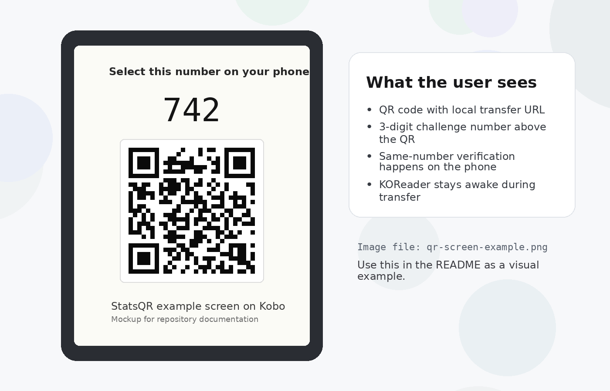
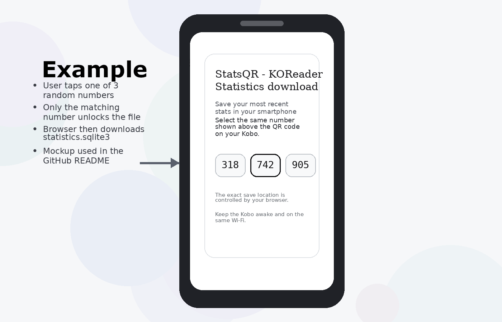

# StatsQR

Made my first plugin.

The idea was pretty simple: I wanted to back up my KOReader reading stats to my phone from time to time, mostly for an upcoming project, so I built a super simple export tool. StatsQR lets you export the `statistics.sqlite3` file straight from your KOReader device to your phone over the same Wi-Fi network. Just open the plugin, scan the QR code, pick the matching code shown on screen, and the download starts automatically. It is a lightweight and simple way to grab your reading stats without connecting cables or digging through folders.

## What it does

StatsQR starts a small local sharing page on your device and shows a QR code on screen.  
When you scan it with your phone, a simple page opens where you choose the matching code shown on the e-reader.  
Once selected correctly, the download of `statistics.sqlite3` starts automatically.

## Current features

- Export `statistics.sqlite3` directly to your phone
- QR-based local transfer
- Simple on-screen number check before download
- Works over the same Wi-Fi network
- Auto-stops sharing after 2 minutes

## How it works

1. Open StatsQR from the KOReader menu
2. Start sharing
3. If Wi-Fi is off, the plugin asks whether it should be turned on
4. A QR code appears on the e-reader together with a number
5. Scan the QR code using your phone
6. On the phone page, select the matching number
7. The file download starts automatically

## Requirements

- KOReader installed on your device
- Phone and e-reader connected to the same Wi-Fi network
- The `statistics.sqlite3` file present in the KOReader settings folder

## File location

StatsQR exports the KOReader statistics database file:

- Kobo: `\.adds\koreader\settings\statistics.sqlite3`
- Kindle: `\koreader\settings\statistics.sqlite3`

## Installation

1. Download the latest plugin release
2. Extract the ZIP
3. Copy the `statsqr.koplugin` folder into your KOReader plugins folder

Typical paths:

- Kobo: `.adds/koreader/plugins/`
- Kindle: `koreader/plugins/`

4. Restart KOReader
5. Open the plugin from the menu

## Usage

1. Open KOReader
2. Launch StatsQR
3. Tap **Start sharing statistics.sqlite3**
4. Scan the QR code with your phone
5. Pick the matching number shown on the device
6. Wait for the download to begin

## Notes

- The transfer happens over your local network
- The phone decides where the file is saved
- Keep the device awake while sharing is active
- Sharing stops automatically after 2 minutes

## Why I made this

I wanted a very simple way to pull KOReader reading stats onto my phone without cables, file browsers, or extra syncing steps. This plugin was built for that exact job and keeps the flow as lightweight as possible.

## Screenshots

### Device QR screen

### Phone page

## Project status

This is a small personal plugin that started as a simple idea and turned into my first KOReader plugin. It works, it is lightweight, and it does exactly what I needed.

## License

See [LICENSE](LICENSE).